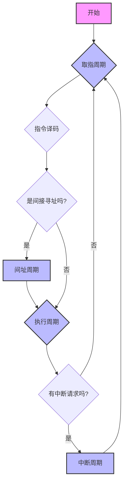

好的，我们来详细讲解一下计算机中一个最核心、最基本的过程——**完整的指令周期（Instruction Cycle）**。

### 1. 什么是指令周期？

**指令周期**是指CPU从内存中取出并执行一条指令所花费的全部时间。它是CPU工作的基本单位，CPU通过不断地重复指令周期来运行程序。一个程序就是由成千上万条指令组成的，CPU执行程序的过程，就是周而复始地执行每一条指令的指令周期。

一个完整的指令周期通常包含以下几个关键的子周期：

1.  **取指周期 (Fetch Cycle)**
2.  **间址周期 (Indirect Cycle)**
3.  **执行周期 (Execute Cycle)**
4.  **中断周期 (Interrupt Cycle)**

下面我们将详细分解这四个阶段，并用流程图和微操作来描述它们。

### 2. 指令周期的完整流程图

下图清晰地展示了四个子周期之间的关系和转换逻辑：

**流程解读：**

*   每个指令周期的开始都是**取指周期**。
*   取到指令后进行**译码**，以确定该做什么以及如何找到操作数。
*   如果指令采用**间接寻址**，就需要先进入**间址周期**去内存中获取真正的操作数地址。
*   之后进入**执行周期**，完成指令规定的操作。
*   执行完毕后，CPU会检查是否有**中断请求**。如果有，则进入**中断周期**处理中断；如果没有，则直接开始下一条指令的**取指周期**。

---

### 3. 各子周期的详细解析（含微操作）

为了更好地理解，我们使用一些常见的寄存器符号：
*   **PC** (Program Counter): 程序计数器，存放下一条指令的地址。
*   **MAR** (Memory Address Register): 存储器地址寄存器，存放要访问的内存单元地址。
*   **MDR** (Memory Data Register): 存储器数据寄存器，暂存从内存读出或要写入内存的数据。
*   **IR** (Instruction Register): 指令寄存器，存放当前正在执行的指令。

#### **(1) 取指周期 (Fetch Cycle)**

**目标**：从内存中获取指令并放入指令寄存器（IR），同时PC指向下一条指令。

**微操作序列**：

1.  `PC -> MAR`
    *   **描述**：将程序计数器（PC）中的地址送到存储器地址寄存器（MAR）。
2.  `1 -> R` (控制信号)
    *   **描述**：CPU通过控制总线发出**读命令**。
3.  `M(MAR) -> MDR`
    *   **描述**：内存根据MAR中的地址，将对应的指令内容通过数据总线送到存储器数据寄存器（MDR）。
4.  `MDR -> IR`
    *   **描述**：将MDR中的指令码送到指令寄存器（IR），准备译码。
5.  `(PC) + 1 -> PC`
    *   **描述**：PC的值加1（这里的“1”代表一条指令的长度，对于变长指令集，增加的量是当前指令的字节数），使其指向下一条指令。

至此，取指周期完成。CPU的控制单元（CU）开始对IR中的指令进行译码。

#### **(2) 间址周期 (Indirect Cycle)**

**目标**：当指令采用间接寻址时，需要通过这个周期从内存中获取操作数的有效地址。

**触发条件**：指令译码后，发现寻址方式位是“间接寻址”。

**微操作序列**：

1.  `IR(Addr) -> MAR`
    *   **描述**：将指令寄存器（IR）中地址字段（形式地址）送到MAR。这个地址指向的内存单元里存的是**真正的地址**。
2.  `1 -> R` (控制信号)
    *   **描述**：发出**读命令**。
3.  `M(MAR) -> MDR`
    *   **描述**：内存将有效地址从指定单元读出，送到MDR。
4.  `MDR -> IR(Addr)`
    *   **描述**：将MDR中的有效地址送回指令寄存器（IR）的地址字段，覆盖掉原来的形式地址。

现在，IR中存放的就是带有直接地址的指令了，可以进入执行周期。

#### **(3) 执行周期 (Execute Cycle)**

**目标**：根据指令的操作码和操作数，完成指定的功能。

**特点**：这个周期的微操作序列**不固定**，完全取决于指令的功能。

**举例说明**：

*   **例1：加法指令 `ADD R1, [X]`** (将内存地址X处的数据与寄存器R1相加，结果存回R1)
    1.  `IR(X) -> MAR` (将指令中的地址X送到MAR)
    2.  `1 -> R` (读命令)
    3.  `M(MAR) -> MDR` (从内存中取出操作数)
    4.  `(R1) + (MDR) -> R1` (由ALU执行加法，结果写回R1)

*   **例2：存数指令 `STO R1, [Y]`** (将寄存器R1的内容存到内存地址Y)
    1.  `IR(Y) -> MAR` (将地址Y送到MAR)
    2.  `R1 -> MDR` (将要存的数据送到MDR)
    3.  `1 -> W` (控制信号，发出**写命令**)
    4.  `MDR -> M(MAR)` (将MDR中的数据写入内存)

*   **例3：无条件跳转指令 `JMP Z`**
    1.  `IR(Z) -> PC` (将指令中的目标地址Z直接送入PC，实现跳转)

#### **(4) 中断周期 (Interrupt Cycle)**

**目标**：响应外部或内部的中断请求，暂停当前程序，转去执行中断服务程序。

**触发条件**：执行周期结束后，CPU检测到有中断信号且中断是允许的（中断总开关开启）。

**微操作序列**（简化模型，通常利用堆栈实现）：

1.  **保存断点**：
    *   `SP - 1 -> SP` (堆栈指针下移，准备压栈)
    *   `PC -> MDR` (将当前PC的值，即下一条指令的地址，送到MDR)
    *   `MDR -> M(SP)` (将返回地址存入堆栈顶部)
    *   **核心目的**：保存被中断程序的返回地址，以便中断处理完后能正确返回。

2.  **保存现场**：
    *   将程序状态字（PSW）等关键寄存器的内容也压入堆栈。这一步对于恢复程序执行时的状态至关重要。

3.  **获取中断服务程序入口地址并跳转**：
    *   CPU根据中断源，从**中断向量表**中找到对应的中断服务程序的入口地址。
    *   `(中断向量地址) -> PC` (将入口地址送入PC)

中断周期结束后，CPU将开始执行中断服务程序的第一条指令，也就是进入了新的取指周期。当中断服务程序执行完 `IRET` (中断返回)指令后，CPU会从堆栈中恢复之前保存的PC和PSW，回到原程序继续执行。

### 总结

完整的指令周期是一个精妙的、自动化的流程，它确保了计算机能够准确无误地执行程序。理解这四个子周期的功能、触发条件以及它们之间的关系，是掌握计算机组成原理和CPU工作方式的基石。