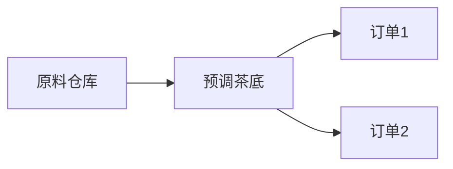

Content Delivery Network , 内容分发网络，建立并覆盖在承载网之上，由分布在不同区域的边缘节点服务器群组成的分布式网络


处理流程
1. 终端向 网址 (www.a.com)发送请求，首先会向LDNS(本地DNS)发起域名解析请求
2. LDNS 检查缓存中收否有(www.a.com) 的IP地址记录，如果有，直接返回终端，如果没有，向 授权DNS查询
3. 授权DNS 解析(www.a.com)，返回域名CNAME www.a.tbcdn.com 对应的IP地址
4. 域名解析请求发送到阿里云DNS 调度系统，并为请求 分配 最佳节点IP地址
5. LDNS 获取DNS返回的解析IP地址
6. 用户获取解析IP地址
7. 用户向获取的IP地址发起对该资源的访问请求
与传统访问方式不同，CDN网络则是在用户和服务器之间增加缓存层，将用户的访问请求引导到最优的缓存节点而不是服务器源站点，从而加速访问速度
缓存预热(预调茶底)

CDN(分店/取餐柜)
```mermaid
graph LR
  中央厨房 --> 分店A
  中央厨房 --> 分店B
  分店A --> 取餐柜1
  分店A --> 取餐柜2
  ```
